# Mental-Maths-Game

A platformer-style game intended to assist students in secondary school with developing  their mental maths skills. Drive your bike or car through the levels, collecting all the coins as you go along and answering all the questions as quick as you can. Chose an appropriate difficulty for questions, rank up in the leaderboard and see if you can improve your statistics. 

---

An A Level project that ws developed over the course of 6 months completly from scratch. Built using Python and the pygame engine and Tiled with pytmx to create and run the graphical maps. 

## Features
- Custom platformer style levels with an interactive character 
- Question boxes ❔ scattered across the map, asking a time-based question when touched 
- Coins 💰 to collect in each level and improve your score
- Shop 🛒 allowing different vehicles to be selected
- Leaderboard 💯 to compare and display your scores with your friends
- Statistics 📊 to learn about your progress whilst playing the game
- Nice graphics in the menu and levels to complement the game
- Awesome animations to liven up the coins and question boxes
- Optional and selectable soundtrack 🎵 to be played during the levels  

---

## How to run 

1. Clone the repository locally
2. Install any verison of Python 🐍 you like
3. Install the following dependancies using pip
   - pygame
   - pymtx
4. Run "python main.py"
5. Enjoy the game 😃

---

## Images of the game
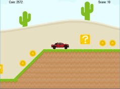 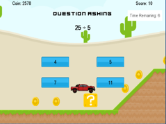 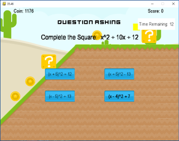 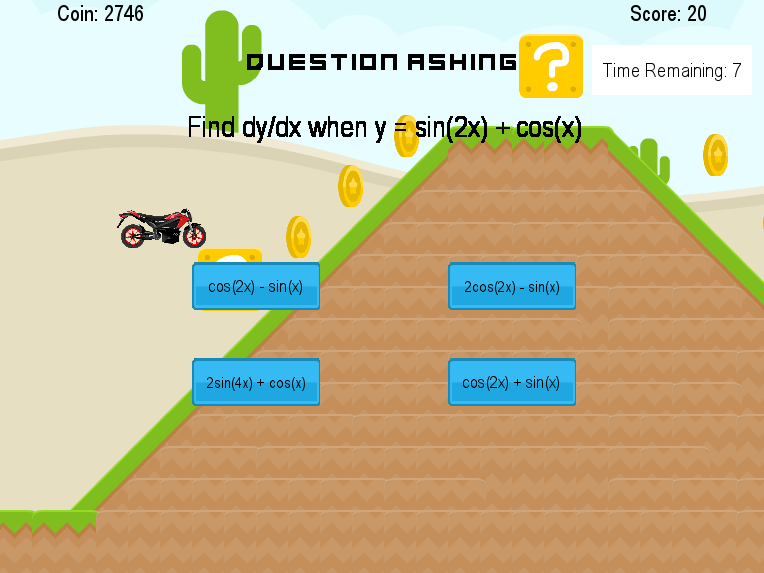 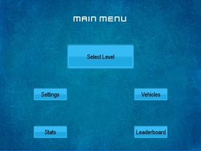 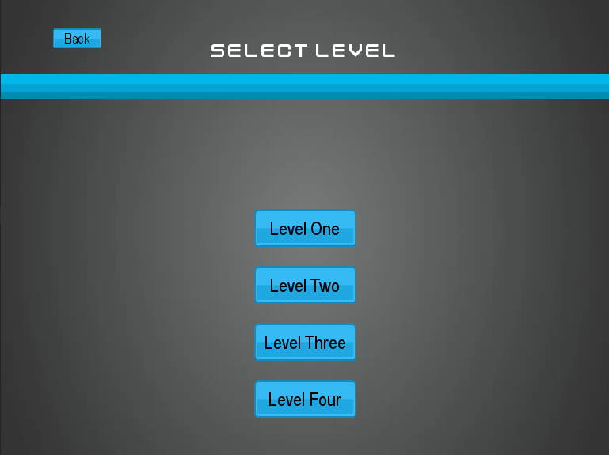 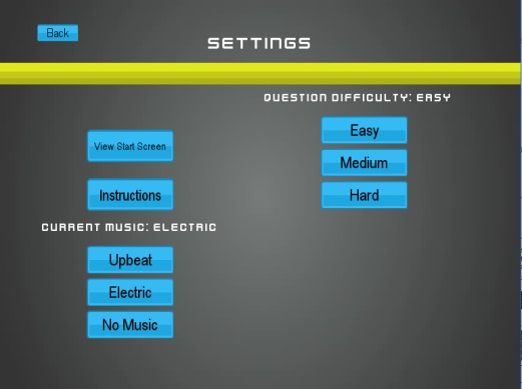 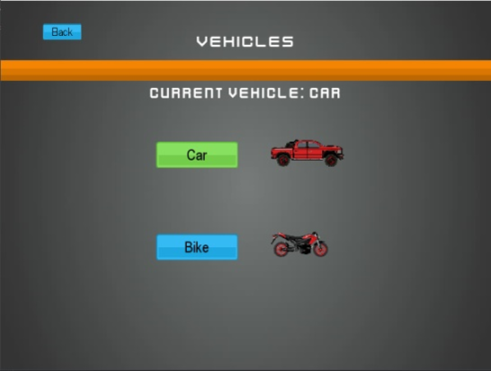 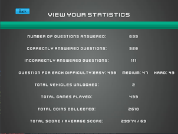 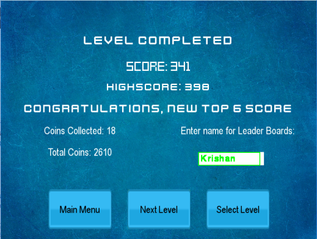 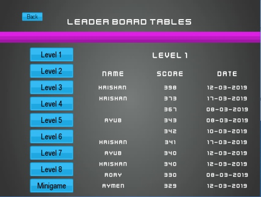 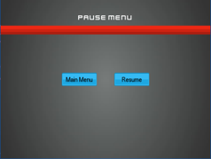 